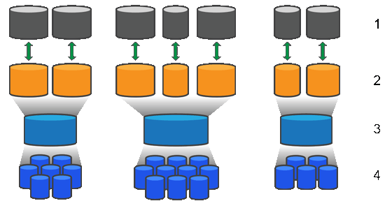

= Funktionsweise von Pools und Volume-Gruppen in der SANtricity-Software
:allow-uri-read: 
:icons: font
:imagesdir: ../media/

[role="lead"]
Um Speicher bereitzustellen, erstellen Sie entweder einen Pool oder eine Volume-Gruppe, die die Festplatten (HDD) oder Solid State Disk (SSD) Laufwerke enthalten, die Sie in Ihrem Speicher-Array verwenden möchten.

Physische Hardware wird in logischen Komponenten bereitgestellt, sodass Daten organisiert und einfach abgerufen werden können. Es werden zwei Arten von Gruppierungen unterstützt:

* Pools
* RAID-Volume-Gruppen

Pools und Volume-Gruppen sind die obersten Storage-Einheiten in einem Storage Array: Sie teilen die Kapazität von Laufwerken in einfach zu verwaltende Abteilungen. Innerhalb dieser logischen Unterteilungen sind die einzelnen Volumes oder LUNs, in denen die Daten gespeichert werden. Dieses Konzept wird in der folgenden Abbildung dargestellt.

^1^ Host-LUNs; ^2^ Volumes; ^3^ Volume-Gruppen oder Pools; ^4^ HDD- oder SSD-Laufwerke

Wenn ein Storage-System implementiert wird, müssen die verschiedenen Hosts über die verfügbare Laufwerkskapazität verfügen:

* Erstellen von Pools oder Volume-Gruppen mit ausreichender Kapazität
* Fügen Sie die Anzahl der erforderlichen Laufwerke hinzu, um den Performance-Anforderungen des Pools oder der Volume-Gruppe zu entsprechen
* Wählen Sie die gewünschte RAID-Schutzstufe (bei Nutzung der Volume-Gruppen) aus, um den spezifischen geschäftlichen Anforderungen gerecht zu werden

Es können zwar Pools oder Volume-Gruppen auf demselben Speichersystem vorhanden sein, ein Laufwerk kann jedoch nicht mehr als ein Pool oder eine Volume-Gruppe umfassen. Volumes, die Hosts für I/O-Vorgänge zur Verfügung gestellt werden, werden dann unter Verwendung des Speicherplatzes im Pool oder der Volume-Gruppe erstellt.

== Pools

Pools wurden entwickelt, um physische Festplatten in einem großen Storage-Bereich zu aggregieren und bieten dafür besseren RAID-Schutz. Ein Pool erstellt viele virtuelle RAID-Sätze von der Gesamtzahl der Laufwerke, die dem Pool zugewiesen sind. Dabei werden die Daten gleichmäßig auf alle teilnehmenden Laufwerke verteilt. Wenn ein Laufwerk verloren geht oder hinzugefügt wird, verteilt System Manager die Daten dynamisch über alle aktiven Laufwerke hinweg.

Pools funktionieren als weitere RAID-Ebene und virtualisieren die zugrunde liegende RAID-Architektur, um die Performance und Flexibilität bei Aufgaben wie Neuaufbau, Laufwerkserweiterung und Handhabung von Laufwerksausfällen zu optimieren. System Manager legt den RAID-Level in einer Konfiguration mit 8+2 automatisch auf 6 fest (acht Datenfestplatten plus zwei Paritätslaufwerke).

=== Abstimmung des Laufwerks

Es besteht die Möglichkeit, entweder HDDs oder SSDs zur Nutzung in Pools zur Verfügung zu stellen. Allerdings müssen wie bei Volume-Gruppen alle Laufwerke im Pool dieselbe Technologie verwenden. Die Controller wählen automatisch aus, welche Laufwerke enthalten sollen. Sie müssen daher sicherstellen, dass Sie über eine ausreichende Anzahl an Laufwerken für die von Ihnen gewählte Technologie verfügen.

=== Verwalten ausgefallener Laufwerke

Pools haben eine minimale Kapazität von 11 Laufwerken, aber die Kapazität eines Laufwerks ist bei einem Laufwerksausfall für freie Kapazität reserviert. Diese freie Kapazität wird als „`Erhaltungskapazität`“ bezeichnet.

Wenn Pools erstellt werden, wird eine bestimmte Menge an Kapazität für den Notfall-Einsatz erhalten. Diese Kapazität wird in System Manager mit einer Anzahl von Laufwerken ausgedrückt, die eigentliche Implementierung wird jedoch über alle Laufwerke hinweg verteilt. Die vorbehaltenen Kapazitätsmengen basieren auf der Anzahl der Laufwerke im Pool.

Nach der Erstellung des Pools können Sie den Wert für die unveränderte Kapazität auf mehr oder weniger Kapazität ändern oder sogar auf keine Speicherkapazität einstellen (Wert von 0 Laufwerken). Die maximale Kapazität, die erhalten bleiben kann (ausgedrückt als Anzahl an Laufwerken), ist 10, die verfügbare Kapazität kann jedoch aufgrund der Gesamtzahl der Laufwerke im Pool kleiner sein.

== Volume-Gruppen

Volume-Gruppen definieren, wie Kapazität im Storage-System Volumes zugewiesen wird. Festplattenlaufwerke sind in RAID-Gruppen eingeteilt und Volumes befinden sich über die Laufwerke in einer RAID-Gruppe hinweg. Aus diesem Grund identifizieren die Konfigurationseinstellungen der Volume-Gruppe, welche Laufwerke Teil der Gruppe sind und welches RAID-Level verwendet wird.

Wenn Sie eine Volume-Gruppe erstellen, wählen Controller automatisch die Laufwerke aus, die in die Gruppe aufgenommen werden sollen. Sie müssen manuell die RAID-Ebene für die Gruppe auswählen. Die Kapazität der Volume-Gruppe entspricht der Gesamtzahl der ausgewählten Laufwerke, multipliziert mit ihrer Kapazität.

=== Abstimmung des Laufwerks

Für die Größe und Performance müssen die Laufwerke in der Volume-Gruppe übereinstimmen. Wenn in der Volume-Gruppe kleinere und größere Laufwerke vorhanden sind, werden alle Laufwerke als die kleinste Kapazitätsgröße erkannt. Wenn es langsamere und schnellere Laufwerke in der Volume-Gruppe gibt, werden alle Laufwerke mit der langsamsten Geschwindigkeit erkannt. Diese Faktoren wirken sich auf die Performance und die Gesamtkapazität des Storage-Systems aus.

Es ist nicht möglich, unterschiedliche Laufwerktechnologien (HDD- und SSD-Laufwerke) miteinander zu kombinieren. RAID 3, 5 und 6 sind auf maximal 30 Laufwerke begrenzt. RAID 1 und RAID 10 verwenden eine Spiegelung, daher müssen diese Volume-Gruppen eine gleichmäßige Anzahl an Festplatten aufweisen.

=== Verwalten ausgefallener Laufwerke

Volume-Gruppen verwenden Hot-Spare-Laufwerke als Standby, falls ein Laufwerk in RAID 1/10-, RAID 3-, RAID 5- oder RAID 6-Volumes einer Volume-Gruppe ausfällt. Ein Hot-Spare-Laufwerk enthält keine Daten und fügt Ihrem Speicher-Array eine weitere Ebene von Redundanz hinzu.

Wenn ein Laufwerk im Speicher-Array ausfällt, wird das Hot-Spare-Laufwerk automatisch durch das ausgefallene Laufwerk ersetzt, ohne dass ein physischer Austausch erforderlich ist. Wenn das Hot-Spare-Laufwerk verfügbar ist, wenn ein Laufwerk ausfällt, verwendet der Controller Redundanzdaten, um die Daten von dem ausgefallenen Laufwerk auf dem Hot-Spare-Laufwerk zu rekonstruieren.
