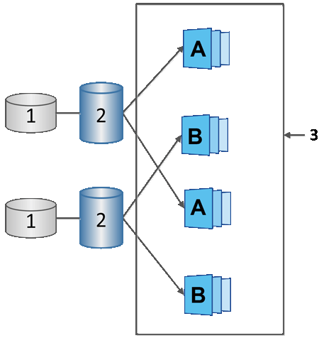

= Snapshot Zeitpläne und Snapshot Konsistenzgruppen
:allow-uri-read: 
:icons: font
:imagesdir: ../media/

[role="lead"]
Nutzen Sie Zeitpläne für die Erfassung von Snapshot Images und managen Sie mithilfe von Snapshot Konsistenzgruppen mehrere Basis-Volumes.

Zur einfachen Verwaltung von Snapshot-Vorgängen für Basis-Volumes können Sie folgende Funktionen verwenden:

* *Snapshot Schedule* -- automatisierte Snapshots für ein einzelnes Basis-Volume.
* *Snapshot Consistency Group* -- Verwalten Sie mehrere Basis-Volumes als eine Einheit.

== Snapshot Zeitplan

Wenn Sie automatisch Snapshots für ein Basis-Volume erstellen möchten, können Sie einen Zeitplan erstellen. Sie können beispielsweise einen Zeitplan festlegen, der jeden Samstag um Mitternacht, am ersten jeden Monat oder an beliebigen Daten und Uhrzeiten Snapshot-Bilder erstellt. Nachdem die maximale Anzahl von 32 Snapshots für einen einzigen Zeitplan erreicht wurde, können Sie die geplanten Snapshots unterbrechen, mehr reservierte Kapazität erstellen oder Snapshots löschen. Snapshots können manuell oder automatisiert gelöscht werden. Nach dem Löschen eines Snapshot Images steht zusätzliche reservierte Kapazität zur Wiederverwendung zur Verfügung.

== Snapshot Konsistenzgruppe

Sie erstellen eine Snapshot-Konsistenzgruppe, wenn Sie sicherstellen möchten, dass Snapshot-Images gleichzeitig auf mehreren Volumes erstellt werden. Aktionen für das Snapshot Image werden auf der gesamten Snapshot-Konsistenzgruppe durchgeführt. Beispielsweise können Sie synchronisierte Snapshots aller Volumes mit dem gleichen Zeitstempel planen. Snapshot-Konsistenzgruppen eignen sich ideal für Applikationen, die mehrere Volumes umfassen, z. B. Datenbankapplikationen, die Protokolle auf einem Volume speichern, und Datenbankdateien auf einem anderen Volume.

Die Volumes, die in einer Snapshot-Konsistenzgruppe enthalten sind, werden als Mitgliedvolumes bezeichnet. Wenn Sie einer Konsistenzgruppe ein Volume hinzufügen, erstellt System Manager automatisch eine neue reservierte Kapazität, die dem entsprechenden Mitglied-Volume entspricht. Sie können einen Zeitplan definieren, in dem automatisch ein Snapshot-Image für jedes Mitgliedsvolume erstellt wird.

^1^ reservierte Kapazität; ^2^ Member Volume; ^3^ Snapshot Images der Konsistenzgruppe
