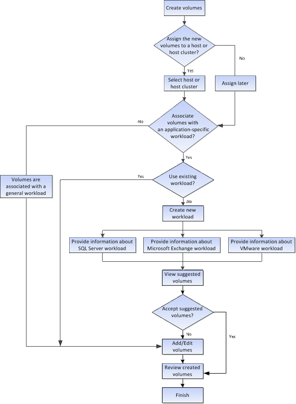

= So funktioniert das Erstellen von Volumes im SANtricity System Manager
:allow-uri-read: 
:icons: font
:imagesdir: ../media/

[role="lead"]
In SANtricity System Manager können Sie Volumes erstellen, indem Sie diese Schritte ausführen.

