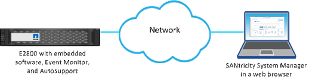

= Erfahren Sie mehr über den Zugriff auf SANtricity System Manager vom Unified Manager aus
:allow-uri-read: 
:icons: font
:imagesdir: ../media/

[role="lead"]
Sie wählen ein oder mehrere Speicher-Arrays aus und öffnen SANtricity System Manager mit der Option Start, wenn Sie Speicher-Arrays konfigurieren und verwalten möchten.

System Manager ist eine eingebettete Applikation auf den Controllern, die über einen Ethernet-Management-Port mit dem Netzwerk verbunden ist. Es umfasst alle Array-basierten Funktionen.

Um auf System Manager zugreifen zu können, müssen Sie Folgendes haben:

* Eines der hier aufgeführten Array-Modelle: link:https://docs.netapp.com/us-en/e-series/getting-started/learn-hardware-concept.html["E-Series Hardware im Überblick"^]
* Eine Out-of-Band-Verbindung zu einem Netzwerk-Management-Client mit einem Webbrowser.

